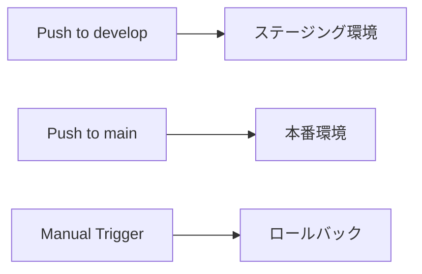

# 本番環境デプロイガイド

このドキュメントでは、ポモドーロタイマーアプリケーションを本番環境にデプロイする手順を説明します。

## 前提条件

- [Vercel CLI](https://vercel.com/cli)がインストールされていること
- [Supabase](https://supabase.com)プロジェクトが作成されていること
- GitHubリポジトリが準備されていること
- Vercel Proプラン（推奨）

## 1. 環境設定

### 1.1 環境変数の準備

```bash
# 環境変数セットアップスクリプトを実行
./scripts/setup-env.sh production

# 生成された .env.production ファイルを編集
# 実際のSupabase URL、API キー等を設定
```

### 1.2 Vercelプロジェクトの設定

```bash
# Vercelにログイン
vercel login

# プロジェクトの初期化
vercel

# 環境変数をVercelにデプロイ
./scripts/deploy-env.sh production
```

## 2. CI/CDパイプライン

### 2.1 GitHub Actions設定

CI/CDパイプラインは自動的に以下を実行します：

- **コード品質チェック**: ESLint、TypeScript型チェック
- **テスト実行**: 単体テスト、プロパティベーステスト、E2Eテスト
- **セキュリティスキャン**: 依存関係の脆弱性チェック
- **ビルド**: 本番環境向け最適化ビルド
- **デプロイ**: ステージング・本番環境への自動デプロイ

### 2.2 品質ゲート

以下の条件をすべて満たした場合のみデプロイが実行されます：

- ✅ ESLint・TypeScriptエラー 0件
- ✅ 単体テスト 100%通過
- ✅ プロパティベーステスト 100%通過
- ✅ ビルド成功
- ✅ セキュリティスキャン通過

### 2.3 デプロイフロー



## 3. 本番環境最適化

### 3.1 Vercel Pro設定

#### パフォーマンス最適化
- **Edge Network**: 世界中のエッジロケーションでの配信
- **Image Optimization**: 自動画像最適化
- **Analytics**: リアルタイムパフォーマンス監視

#### セキュリティ強化
- **DDoS Protection**: 自動DDoS攻撃防御
- **Web Application Firewall**: アプリケーションレベルの保護
- **SSL/TLS**: 自動SSL証明書管理

### 3.2 CDN最適化

```javascript
// vercel.json - キャッシュ戦略
{
  "headers": [
    {
      "source": "/(.*\\.(js|css|png|jpg|jpeg|gif|ico|svg|woff|woff2|ttf|eot))",
      "headers": [
        {
          "key": "Cache-Control",
          "value": "public, max-age=31536000, immutable"
        }
      ]
    }
  ]
}
```

### 3.3 セキュリティヘッダー

本番環境では以下のセキュリティヘッダーが自動設定されます：

- **HSTS**: `Strict-Transport-Security: max-age=31536000; includeSubDomains; preload`
- **CSP**: Content Security Policy による XSS 攻撃防御
- **X-Frame-Options**: クリックジャッキング攻撃防御
- **X-Content-Type-Options**: MIME タイプスニッフィング防御

## 4. 環境変数管理

### 4.1 本番環境必須変数

```bash
# アプリケーション設定
VITE_APP_ENV=production
VITE_APP_VERSION=1.0.0
VITE_APP_NAME="Pomodoro Timer"

# Supabase設定
VITE_SUPABASE_URL=https://your-project.supabase.co
VITE_SUPABASE_ANON_KEY=your-anon-key

# 監視・分析
VITE_SENTRY_DSN=https://your-sentry-dsn@sentry.io/project-id
VITE_VERCEL_ANALYTICS_ID=your-analytics-id

# セキュリティ設定
VITE_ENABLE_CSP=true
VITE_ENABLE_SOURCE_MAPS=false
```

### 4.2 環境変数の暗号化

Vercelでは環境変数が自動的に暗号化されて保存されます：

```bash
# 環境変数の確認
vercel env ls

# 特定環境の環境変数取得
vercel env pull .env.production --environment=production
```

## 5. カスタムドメイン設定

### 5.1 ドメイン追加

```bash
# Vercel CLIでドメイン追加
vercel domains add your-domain.com

# DNS設定確認
vercel domains inspect your-domain.com
```

### 5.2 DNS設定

```dns
# CNAMEレコード設定例
Type: CNAME
Name: @
Value: cname.vercel-dns.com

# Aレコード設定例（ルートドメイン）
Type: A
Name: @
Value: 76.76.19.61
```

## 6. 監視とアラート

### 6.1 パフォーマンス監視

```bash
# Core Web Vitals監視
# - LCP (Largest Contentful Paint) < 2.5s
# - FID (First Input Delay) < 100ms
# - CLS (Cumulative Layout Shift) < 0.1
```

### 6.2 エラー監視

Sentryによるリアルタイムエラー監視：

- JavaScript例外の自動キャッチ
- パフォーマンス問題の検出
- ユーザーセッションの記録
- アラート通知の設定

### 6.3 稼働率監視

```bash
# ヘルスチェックエンドポイント
GET /api/health-check

# 期待レスポンス
{
  "status": "healthy",
  "timestamp": "2024-12-30T10:00:00Z",
  "version": "1.0.0"
}
```

## 7. ロールバック手順

### 7.1 自動ロールバック

品質ゲートに失敗した場合、自動的に前のバージョンにロールバックされます。

### 7.2 手動ロールバック

```bash
# GitHub Actionsから手動実行
# 1. GitHub > Actions > Manual Rollback
# 2. 環境選択（production/staging）
# 3. ロールバック理由入力
# 4. 実行

# または Vercel CLIから
vercel rollback [deployment-url] --prod
```

### 7.3 ロールバック後の確認

```bash
# ヘルスチェック実行
curl -f https://your-domain.com/api/health-check

# パフォーマンステスト
pnpm run lighthouse https://your-domain.com
```

## 8. セキュリティ設定

### 8.1 Content Security Policy

```http
Content-Security-Policy: 
  default-src 'self'; 
  script-src 'self' 'unsafe-inline' 'unsafe-eval' https://*.vercel.app https://*.supabase.co https://*.sentry.io; 
  style-src 'self' 'unsafe-inline' https://fonts.googleapis.com; 
  font-src 'self' https://fonts.gstatic.com; 
  img-src 'self' data: https:; 
  connect-src 'self' https://*.supabase.co https://*.sentry.io wss://*.supabase.co;
```

### 8.2 API セキュリティ

- **Rate Limiting**: API呼び出し頻度制限
- **CORS設定**: 適切なオリジン制限
- **認証トークン**: JWT トークンの適切な管理

## 9. パフォーマンス最適化

### 9.1 ビルド最適化

```javascript
// vite.config.ts - 本番環境設定
export default defineConfig({
  build: {
    minify: 'terser',
    terserOptions: {
      compress: {
        drop_console: true,
        drop_debugger: true,
      },
    },
    rollupOptions: {
      output: {
        manualChunks: {
          'react-vendor': ['react', 'react-dom'],
          'supabase-vendor': ['@supabase/supabase-js'],
          'ui-vendor': ['@headlessui/react', '@heroicons/react'],
        },
      },
    },
  },
});
```

### 9.2 キャッシュ戦略

- **静的アセット**: 1年間キャッシュ（immutable）
- **HTML**: キャッシュなし（常に最新）
- **API レスポンス**: 5分間キャッシュ
- **Service Worker**: キャッシュなし（即座更新）

## 10. 災害復旧

### 10.1 バックアップ戦略

- **コード**: GitHubリポジトリ
- **データベース**: Supabase自動バックアップ
- **設定**: 環境変数のバックアップ
- **デプロイ履歴**: Vercelデプロイ履歴

### 10.2 復旧手順

```bash
# 1. 問題の特定
vercel logs --follow

# 2. ロールバック実行
vercel rollback [previous-deployment] --prod

# 3. ヘルスチェック
curl -f https://your-domain.com/api/health-check

# 4. 監視ダッシュボード確認
# - Vercel Analytics
# - Sentry Error Monitoring
# - Supabase Dashboard
```

## 11. 運用チェックリスト

### 11.1 デプロイ前チェック

- [ ] 全テスト通過確認
- [ ] セキュリティスキャン実行
- [ ] パフォーマンステスト実行
- [ ] 環境変数設定確認
- [ ] バックアップ確認

### 11.2 デプロイ後チェック

- [ ] ヘルスチェック実行
- [ ] 主要機能動作確認
- [ ] パフォーマンス指標確認
- [ ] エラー監視設定確認
- [ ] SSL証明書確認

### 11.3 定期メンテナンス

- [ ] 依存関係更新（月次）
- [ ] セキュリティパッチ適用（即座）
- [ ] パフォーマンス分析（週次）
- [ ] ログ分析（日次）
- [ ] バックアップ確認（日次）

## 参考リンク

- [Vercel Pro Documentation](https://vercel.com/docs/concepts/limits/overview)
- [Supabase Production Checklist](https://supabase.com/docs/guides/platform/going-into-prod)
- [Web.dev Performance](https://web.dev/performance/)
- [OWASP Security Guidelines](https://owasp.org/www-project-web-security-testing-guide/)
- [Core Web Vitals](https://web.dev/vitals/)
