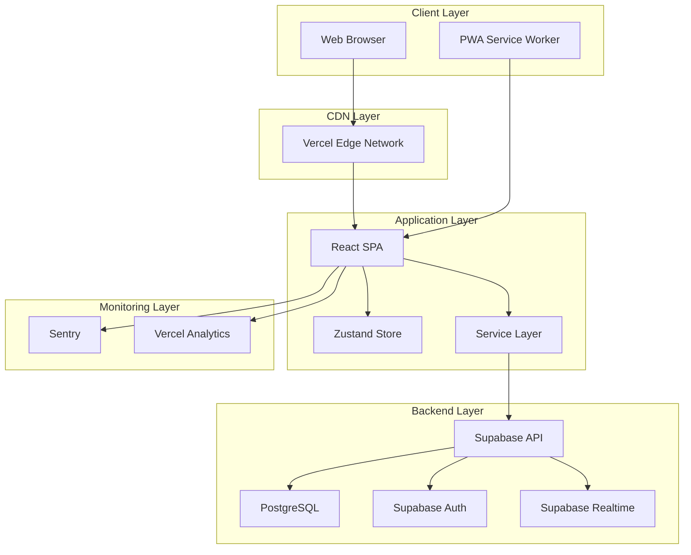
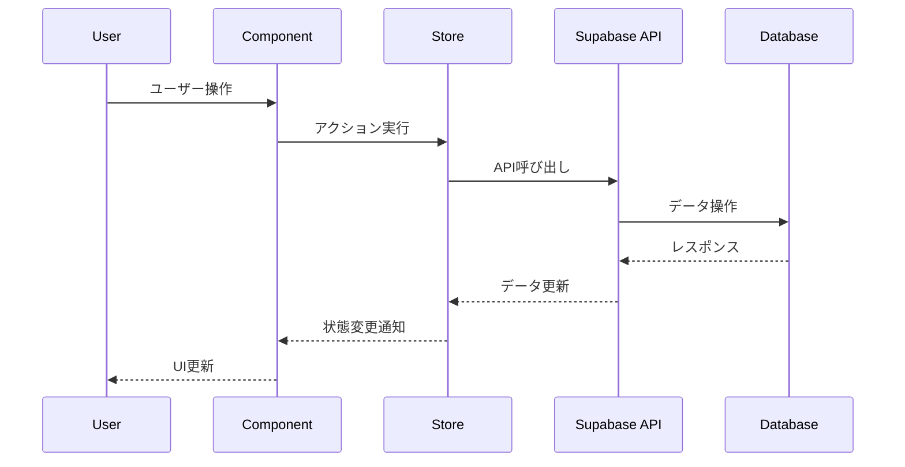
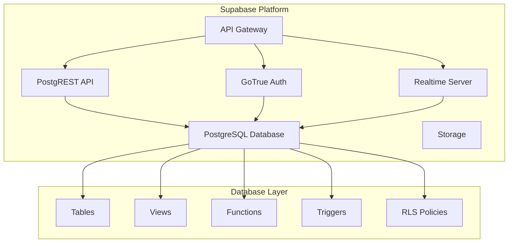
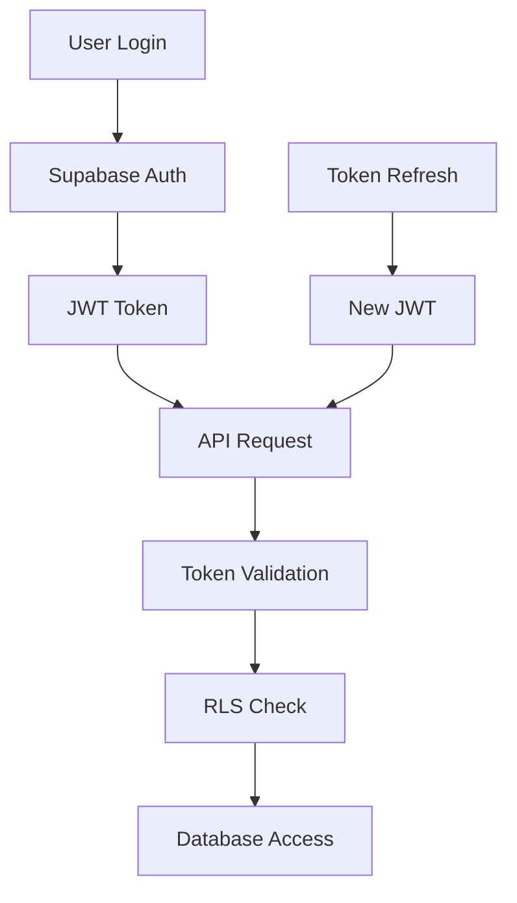
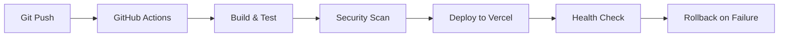

# アーキテクチャドキュメント

## 目次

1. [概要](#概要)
2. [システムアーキテクチャ](#システムアーキテクチャ)
3. [フロントエンドアーキテクチャ](#フロントエンドアーキテクチャ)
4. [バックエンドアーキテクチャ](#バックエンドアーキテクチャ)
5. [データアーキテクチャ](#データアーキテクチャ)
6. [セキュリティアーキテクチャ](#セキュリティアーキテクチャ)
7. [デプロイメントアーキテクチャ](#デプロイメントアーキテクチャ)
8. [パフォーマンス設計](#パフォーマンス設計)
9. [スケーラビリティ](#スケーラビリティ)
10. [技術的決定事項](#技術的決定事項)

## 概要

ポモドーロタイマーは、モダンなWeb技術を使用して構築された
シングルページアプリケーション（SPA）です。

### 設計原則

- **モジュラー設計**: 疎結合で高凝集なコンポーネント構成
- **レスポンシブデザイン**: あらゆるデバイスサイズに対応
- **アクセシビリティファースト**: WCAG 2.1 AA準拠
- **パフォーマンス重視**: 高速な読み込みと応答性
- **セキュリティ**: データ保護とプライバシー重視
- **スケーラビリティ**: 将来の拡張に対応可能な設計

### 技術スタック概要

| レイヤー       | 技術                      | 役割                       |
| -------------- | ------------------------- | -------------------------- |
| フロントエンド | React 18 + TypeScript     | UI/UX                      |
| 状態管理       | Zustand                   | クライアント状態管理       |
| スタイリング   | Tailwind CSS              | デザインシステム           |
| バックエンド   | Supabase                  | データベース・認証・API    |
| ホスティング   | Vercel                    | CDN・デプロイメント        |
| 監視           | Sentry + Vercel Analytics | エラー・パフォーマンス監視 |

## システムアーキテクチャ

### 全体構成図



### データフロー



## フロントエンドアーキテクチャ

### コンポーネント構成

```
src/
├── components/          # 再利用可能なコンポーネント
│   ├── ui/             # 基本UIコンポーネント
│   ├── timer/          # タイマー関連コンポーネント
│   ├── tasks/          # タスク管理コンポーネント
│   ├── statistics/     # 統計表示コンポーネント
│   └── layout/         # レイアウトコンポーネント
├── pages/              # ページコンポーネント
├── hooks/              # カスタムフック
├── stores/             # 状態管理
├── services/           # 外部サービス連携
├── utils/              # ユーティリティ関数
└── types/              # TypeScript型定義
```

### 状態管理アーキテクチャ

```typescript
// Store構成
interface AppState {
  // 認証状態
  auth: AuthState;

  // タイマー状態
  timer: TimerState;

  // タスク状態
  tasks: TasksState;

  // UI状態
  ui: UIState;

  // 設定状態
  settings: SettingsState;
}
```

#### Zustand Store設計

```typescript
// 各Storeは独立して管理
const useAuthStore = create<AuthState>((set, get) => ({
  user: null,
  isAuthenticated: false,
  login: async credentials => {
    // 認証ロジック
  },
  logout: async () => {
    // ログアウトロジック
  },
}));

const useTimerStore = create<TimerState>((set, get) => ({
  currentSession: 'pomodoro',
  timeRemaining: 1500,
  isRunning: false,
  start: () => set({ isRunning: true }),
  pause: () => set({ isRunning: false }),
  reset: () => set({ timeRemaining: 1500, isRunning: false }),
}));
```

### コンポーネント設計パターン

#### 1. Container/Presentational パターン

```typescript
// Container Component (ロジック担当)
const TimerContainer: React.FC = () => {
  const { timeRemaining, isRunning, start, pause } = useTimerStore()
  const { currentTask } = useTasksStore()

  return (
    <TimerPresentation
      timeRemaining={timeRemaining}
      isRunning={isRunning}
      currentTask={currentTask}
      onStart={start}
      onPause={pause}
    />
  )
}

// Presentational Component (表示担当)
interface TimerPresentationProps {
  timeRemaining: number
  isRunning: boolean
  currentTask?: Task
  onStart: () => void
  onPause: () => void
}

const TimerPresentation: React.FC<TimerPresentationProps> = ({
  timeRemaining,
  isRunning,
  currentTask,
  onStart,
  onPause
}) => {
  return (
    <div className="timer">
      <TimerDisplay time={timeRemaining} />
      <TimerControls
        isRunning={isRunning}
        onStart={onStart}
        onPause={onPause}
      />
      {currentTask && <CurrentTask task={currentTask} />}
    </div>
  )
}
```

#### 2. Compound Component パターン

```typescript
// 複合コンポーネントの設計
const Timer = {
  Root: TimerRoot,
  Display: TimerDisplay,
  Controls: TimerControls,
  Progress: TimerProgress
}

// 使用例
<Timer.Root>
  <Timer.Display />
  <Timer.Progress />
  <Timer.Controls />
</Timer.Root>
```

### カスタムフック設計

```typescript
// ビジネスロジックをフックに抽象化
const useTimer = (initialDuration: number) => {
  const [timeRemaining, setTimeRemaining] = useState(initialDuration);
  const [isRunning, setIsRunning] = useState(false);
  const intervalRef = useRef<NodeJS.Timeout>();

  const start = useCallback(() => {
    setIsRunning(true);
    intervalRef.current = setInterval(() => {
      setTimeRemaining(prev => {
        if (prev <= 1) {
          setIsRunning(false);
          return 0;
        }
        return prev - 1;
      });
    }, 1000);
  }, []);

  const pause = useCallback(() => {
    setIsRunning(false);
    if (intervalRef.current) {
      clearInterval(intervalRef.current);
    }
  }, []);

  useEffect(() => {
    return () => {
      if (intervalRef.current) {
        clearInterval(intervalRef.current);
      }
    };
  }, []);

  return { timeRemaining, isRunning, start, pause };
};
```

## バックエンドアーキテクチャ

### Supabase アーキテクチャ



### データベース設計

#### テーブル構造

```sql
-- ユーザーテーブル（Supabase Auth拡張）
CREATE TABLE public.users (
  id UUID REFERENCES auth.users PRIMARY KEY,
  display_name TEXT,
  timezone TEXT DEFAULT 'Asia/Tokyo',
  created_at TIMESTAMPTZ DEFAULT NOW(),
  updated_at TIMESTAMPTZ DEFAULT NOW()
);

-- タスクテーブル
CREATE TABLE public.tasks (
  id UUID PRIMARY KEY DEFAULT gen_random_uuid(),
  user_id UUID REFERENCES public.users(id) ON DELETE CASCADE,
  title TEXT NOT NULL,
  description TEXT,
  estimated_pomodoros INTEGER DEFAULT 1,
  completed_pomodoros INTEGER DEFAULT 0,
  is_completed BOOLEAN DEFAULT FALSE,
  priority task_priority DEFAULT 'medium',
  tags TEXT[] DEFAULT '{}',
  created_at TIMESTAMPTZ DEFAULT NOW(),
  updated_at TIMESTAMPTZ DEFAULT NOW(),
  completed_at TIMESTAMPTZ
);

-- セッションテーブル
CREATE TABLE public.sessions (
  id UUID PRIMARY KEY DEFAULT gen_random_uuid(),
  user_id UUID REFERENCES public.users(id) ON DELETE CASCADE,
  task_id UUID REFERENCES public.tasks(id) ON DELETE SET NULL,
  task_title TEXT,
  type session_type NOT NULL,
  mode session_mode DEFAULT 'standalone',
  planned_duration INTEGER NOT NULL,
  actual_duration INTEGER DEFAULT 0,
  completed BOOLEAN DEFAULT FALSE,
  started_at TIMESTAMPTZ DEFAULT NOW(),
  completed_at TIMESTAMPTZ,
  created_at TIMESTAMPTZ DEFAULT NOW()
);
```

#### Row Level Security (RLS)

```sql
-- ユーザーは自分のデータのみアクセス可能
ALTER TABLE public.tasks ENABLE ROW LEVEL SECURITY;

CREATE POLICY "Users can view own tasks" ON public.tasks
  FOR SELECT USING (auth.uid() = user_id);

CREATE POLICY "Users can insert own tasks" ON public.tasks
  FOR INSERT WITH CHECK (auth.uid() = user_id);

CREATE POLICY "Users can update own tasks" ON public.tasks
  FOR UPDATE USING (auth.uid() = user_id);

CREATE POLICY "Users can delete own tasks" ON public.tasks
  FOR DELETE USING (auth.uid() = user_id);
```

### API設計

#### RESTful API エンドポイント

```typescript
// タスク管理API
GET    /rest/v1/tasks              // タスク一覧取得
POST   /rest/v1/tasks              // タスク作成
GET    /rest/v1/tasks?id=eq.{id}   // 特定タスク取得
PATCH  /rest/v1/tasks?id=eq.{id}   // タスク更新
DELETE /rest/v1/tasks?id=eq.{id}   // タスク削除

// セッション管理API
GET    /rest/v1/sessions           // セッション履歴取得
POST   /rest/v1/sessions           // セッション作成
PATCH  /rest/v1/sessions?id=eq.{id} // セッション更新

// 統計API
POST   /rest/v1/rpc/get_user_statistics // 統計データ取得
```

#### リアルタイム機能

```typescript
// WebSocket接続によるリアルタイム同期
const subscription = supabase
  .channel('user-sessions')
  .on(
    'postgres_changes',
    {
      event: '*',
      schema: 'public',
      table: 'sessions',
      filter: `user_id=eq.${userId}`,
    },
    payload => {
      // セッション変更の処理
      handleSessionChange(payload);
    }
  )
  .subscribe();
```

## データアーキテクチャ

### データモデル設計

```typescript
// 型定義による厳密なデータモデル
interface Task {
  id: string;
  userId: string;
  title: string;
  description?: string;
  estimatedPomodoros?: number;
  completedPomodoros: number;
  isCompleted: boolean;
  priority: 'low' | 'medium' | 'high';
  tags: string[];
  createdAt: string;
  updatedAt: string;
  completedAt?: string;
}

interface Session {
  id: string;
  userId: string;
  taskId?: string;
  taskTitle?: string;
  type: 'pomodoro' | 'short_break' | 'long_break';
  mode: 'standalone' | 'task-linked';
  plannedDuration: number;
  actualDuration: number;
  completed: boolean;
  startedAt: string;
  completedAt?: string;
  createdAt: string;
}
```

### データフロー設計

#### 1. 楽観的更新

```typescript
const updateTask = async (taskId: string, updates: Partial<Task>) => {
  // 1. UIを即座に更新（楽観的更新）
  updateTaskInStore(taskId, updates);

  try {
    // 2. サーバーに送信
    const { data, error } = await supabase
      .from('tasks')
      .update(updates)
      .eq('id', taskId)
      .select()
      .single();

    if (error) throw error;

    // 3. サーバーレスポンスで最終更新
    updateTaskInStore(taskId, data);
  } catch (error) {
    // 4. エラー時は元に戻す
    revertTaskUpdate(taskId);
    throw error;
  }
};
```

#### 2. オフライン対応

```typescript
// オフライン時のデータキューイング
class OfflineQueue {
  private queue: PendingAction[] = [];

  async addAction(action: PendingAction) {
    this.queue.push(action);
    await this.saveToLocalStorage();

    if (navigator.onLine) {
      await this.processQueue();
    }
  }

  async processQueue() {
    while (this.queue.length > 0) {
      const action = this.queue.shift()!;
      try {
        await this.executeAction(action);
      } catch (error) {
        // エラー時は再度キューに追加
        this.queue.unshift(action);
        break;
      }
    }
  }
}
```

### キャッシュ戦略

#### 1. ブラウザキャッシュ

```typescript
// React Query / SWR パターンの実装
const useTasksQuery = () => {
  return useQuery({
    queryKey: ['tasks'],
    queryFn: fetchTasks,
    staleTime: 5 * 60 * 1000, // 5分間はフレッシュ
    cacheTime: 10 * 60 * 1000, // 10分間キャッシュ保持
  });
};
```

#### 2. Service Worker キャッシュ

```typescript
// PWA Service Worker でのキャッシュ戦略
self.addEventListener('fetch', event => {
  if (event.request.url.includes('/api/')) {
    // API リクエストは Network First
    event.respondWith(networkFirst(event.request));
  } else {
    // 静的リソースは Cache First
    event.respondWith(cacheFirst(event.request));
  }
});
```

## セキュリティアーキテクチャ

### 認証・認可



#### JWT トークン管理

```typescript
// 自動トークンリフレッシュ
class AuthService {
  private refreshTimer?: NodeJS.Timeout;

  async login(email: string, password: string) {
    const { data, error } = await supabase.auth.signInWithPassword({
      email,
      password,
    });

    if (data.session) {
      this.scheduleTokenRefresh(data.session.expires_at);
    }

    return { data, error };
  }

  private scheduleTokenRefresh(expiresAt: number) {
    const refreshTime = expiresAt * 1000 - Date.now() - 60000; // 1分前

    this.refreshTimer = setTimeout(async () => {
      await supabase.auth.refreshSession();
    }, refreshTime);
  }
}
```

### データ保護

#### 1. 暗号化

- **転送時暗号化**: HTTPS/TLS 1.3
- **保存時暗号化**: AES-256 (Supabase)
- **キー管理**: AWS KMS (Supabase)

#### 2. 入力検証

```typescript
// Zod による型安全な入力検証
const TaskSchema = z.object({
  title: z.string().min(1).max(255),
  description: z.string().max(1000).optional(),
  estimatedPomodoros: z.number().int().min(1).max(20).optional(),
  priority: z.enum(['low', 'medium', 'high']),
  tags: z.array(z.string().max(50)).max(10),
});

const validateTask = (input: unknown): Task => {
  return TaskSchema.parse(input);
};
```

#### 3. XSS/CSRF対策

```typescript
// Content Security Policy
const cspHeader = `
  default-src 'self';
  script-src 'self' 'unsafe-inline' https://cdn.jsdelivr.net;
  style-src 'self' 'unsafe-inline';
  img-src 'self' data: https:;
  connect-src 'self' https://*.supabase.co;
  font-src 'self';
`;

// CSRF トークン（Supabase が自動処理）
// XSS 対策（React が自動エスケープ）
```

## デプロイメントアーキテクチャ

### CI/CD パイプライン



#### GitHub Actions ワークフロー

```yaml
name: CI/CD Pipeline

on:
  push:
    branches: [main]
  pull_request:
    branches: [main]

jobs:
  test:
    runs-on: ubuntu-latest
    steps:
      - uses: actions/checkout@v3
      - uses: actions/setup-node@v3
        with:
          node-version: '18'
          cache: 'pnpm'

      - run: pnpm install
      - run: pnpm type-check
      - run: pnpm lint
      - run: pnpm test
      - run: pnpm build

  deploy:
    needs: test
    runs-on: ubuntu-latest
    if: github.ref == 'refs/heads/main'
    steps:
      - uses: actions/checkout@v3
      - uses: amondnet/vercel-action@v20
        with:
          vercel-token: ${{ secrets.VERCEL_TOKEN }}
          vercel-org-id: ${{ secrets.ORG_ID }}
          vercel-project-id: ${{ secrets.PROJECT_ID }}
```

### 環境構成

| 環境        | 用途         | URL             | デプロイ |
| ----------- | ------------ | --------------- | -------- |
| Development | 開発         | localhost:5173  | ローカル |
| Preview     | レビュー     | \*.vercel.app   | PR毎     |
| Staging     | ステージング | staging.app.com | develop  |
| Production  | 本番         | app.com         | main     |

### 監視・ログ

```typescript
// エラー監視（Sentry）
import * as Sentry from '@sentry/react'

Sentry.init({
  dsn: process.env.VITE_SENTRY_DSN,
  environment: process.env.VITE_APP_ENV,
  tracesSampleRate: 1.0,
})

// パフォーマンス監視（Vercel Analytics）
import { Analytics } from '@vercel/analytics/react'

function App() {
  return (
    <>
      <Router />
      <Analytics />
    </>
  )
}
```

## パフォーマンス設計

### フロントエンド最適化

#### 1. コード分割

```typescript
// ルートベースの遅延読み込み
const TimerPage = lazy(() => import('./pages/TimerPage'));
const TasksPage = lazy(() => import('./pages/TasksPage'));
const StatisticsPage = lazy(() => import('./pages/StatisticsPage'));

// コンポーネントベースの分割
const HeavyChart = lazy(() => import('./components/HeavyChart'));
```

#### 2. バンドル最適化

```typescript
// Vite設定
export default defineConfig({
  build: {
    rollupOptions: {
      output: {
        manualChunks: {
          vendor: ['react', 'react-dom'],
          ui: ['@headlessui/react', 'framer-motion'],
          charts: ['recharts', 'd3'],
        },
      },
    },
  },
});
```

#### 3. 画像最適化

```typescript
// 次世代画像フォーマット対応
const OptimizedImage: React.FC<ImageProps> = ({ src, alt, ...props }) => {
  return (
    <picture>
      <source srcSet={`${src}.webp`} type="image/webp" />
      <source srcSet={`${src}.avif`} type="image/avif" />
      
    </picture>
  )
}
```

### データベース最適化

#### 1. インデックス設計

```sql
-- 頻繁なクエリに対するインデックス
CREATE INDEX idx_tasks_user_id_created_at
ON tasks(user_id, created_at DESC);

CREATE INDEX idx_sessions_user_id_started_at
ON sessions(user_id, started_at DESC);

-- 複合インデックス
CREATE INDEX idx_tasks_user_completed_priority
ON tasks(user_id, is_completed, priority);
```

#### 2. クエリ最適化

```typescript
// 効率的なデータ取得
const getTasksWithStats = async (userId: string) => {
  const { data } = await supabase
    .from('tasks')
    .select(
      `
      *,
      sessions:sessions(count)
    `
    )
    .eq('user_id', userId)
    .order('created_at', { ascending: false })
    .limit(50);

  return data;
};
```

## スケーラビリティ

### 水平スケーリング

#### 1. CDN活用

```typescript
// Vercel Edge Network による配信最適化
// - 静的アセットの地理的分散
// - エッジでのキャッシュ
// - 自動的な最適化
```

#### 2. データベーススケーリング

```sql
-- パーティショニング（将来的な対応）
CREATE TABLE sessions_2024 PARTITION OF sessions
FOR VALUES FROM ('2024-01-01') TO ('2025-01-01');

-- 読み取り専用レプリカ（Supabase Pro）
-- 統計クエリ用の専用接続
```

### 垂直スケーリング

#### 1. メモリ最適化

```typescript
// React.memo による不要な再レンダリング防止
const TaskItem = React.memo<TaskItemProps>(({ task, onUpdate }) => {
  return <div>{task.title}</div>
}, (prevProps, nextProps) => {
  return prevProps.task.id === nextProps.task.id &&
         prevProps.task.updatedAt === nextProps.task.updatedAt
})

// useMemo による計算結果キャッシュ
const expensiveValue = useMemo(() => {
  return calculateComplexStatistics(sessions)
}, [sessions])
```

#### 2. 仮想化

```typescript
// 大量データの仮想スクロール
import { FixedSizeList as List } from 'react-window'

const VirtualizedTaskList: React.FC<{ tasks: Task[] }> = ({ tasks }) => (
  <List
    height={600}
    itemCount={tasks.length}
    itemSize={60}
    itemData={tasks}
  >
    {TaskItemRenderer}
  </List>
)
```

## 技術的決定事項

### フレームワーク選択

#### React vs Vue vs Angular

**React を選択した理由:**

- 豊富なエコシステム
- TypeScript との親和性
- パフォーマンス最適化機能
- 開発者の習熟度
- コミュニティサポート

### 状態管理選択

#### Zustand vs Redux vs Context API

**Zustand を選択した理由:**

- シンプルなAPI
- TypeScript サポート
- 小さなバンドルサイズ
- ボイラープレートが少ない
- 学習コストが低い

### バックエンド選択

#### Supabase vs Firebase vs 自前API

**Supabase を選択した理由:**

- PostgreSQL ベース
- リアルタイム機能
- Row Level Security
- オープンソース
- 開発速度

### CSS フレームワーク選択

#### Tailwind CSS vs Styled Components vs CSS Modules

**Tailwind CSS を選択した理由:**

- ユーティリティファースト
- 一貫したデザインシステム
- 高いカスタマイズ性
- 優れたパフォーマンス
- 開発効率

### テストフレームワーク選択

#### Vitest vs Jest

**Vitest を選択した理由:**

- Vite との統合
- 高速な実行速度
- ESM サポート
- TypeScript ネイティブサポート
- モダンな機能

---

## 今後の技術的課題

### 短期的課題（1-3ヶ月）

- [ ] パフォーマンス最適化
- [ ] テストカバレッジ向上
- [ ] アクセシビリティ改善
- [ ] セキュリティ強化

### 中期的課題（3-6ヶ月）

- [ ] モバイルアプリ対応
- [ ] オフライン機能強化
- [ ] 多言語対応
- [ ] 高度な分析機能

### 長期的課題（6ヶ月以上）

- [ ] マイクロサービス化
- [ ] AI/ML 機能統合
- [ ] リアルタイム協業機能
- [ ] プラグインシステム

---

_このアーキテクチャドキュメントは、システムの成長と共に継続的に更新されます。_
