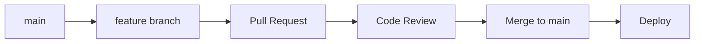

# コントリビューションガイド

## 目次

1. [はじめに](#はじめに)
2. [コントリビューションの種類](#コントリビューションの種類)
3. [開発環境のセットアップ](#開発環境のセットアップ)
4. [開発ワークフロー](#開発ワークフロー)
5. [コーディング規約](#コーディング規約)
6. [テストガイドライン](#テストガイドライン)
7. [プルリクエストガイドライン](#プルリクエストガイドライン)
8. [Issue報告](#issue報告)
9. [コミュニティガイドライン](#コミュニティガイドライン)

## はじめに

ポモドーロタイマープロジェクトへのコントリビューションに興味を持っていただき、ありがとうございます！このガイドでは、プロジェクトに貢献するための手順とガイドラインを説明します。

### プロジェクトの目標

- **使いやすさ**: 直感的で分かりやすいユーザーインターフェース
- **アクセシビリティ**: すべてのユーザーが利用できる包括的な設計
- **パフォーマンス**: 高速で応答性の良いアプリケーション
- **品質**: 堅牢で信頼性の高いコード
- **オープンソース**: 透明性とコミュニティ主導の開発

## コントリビューションの種類

### 1. コード貢献

#### 新機能の開発

- 新しい機能の実装
- 既存機能の改善・拡張
- パフォーマンスの最適化

#### バグ修正

- 既知のバグの修正
- エッジケースの対応
- 互換性問題の解決

#### リファクタリング

- コードの可読性向上
- アーキテクチャの改善
- 技術的負債の解消

### 2. ドキュメント貢献

- ユーザーガイドの改善
- 開発者ドキュメントの更新
- API仕様書の修正
- コメントの追加・改善

### 3. テスト貢献

- 単体テストの追加
- E2Eテストの作成
- プロパティベーステストの実装
- テストカバレッジの向上

### 4. デザイン貢献

- UIデザインの改善
- UXの最適化
- アクセシビリティの向上
- レスポンシブデザインの改善

### 5. その他の貢献

- バグ報告
- 機能要望
- ユーザーサポート
- 翻訳・国際化

## 開発環境のセットアップ

詳細な手順は [開発環境セットアップガイド](./development-setup.md) を参照してください。

### クイックスタート

```bash
# 1. リポジトリをフォーク・クローン
git clone https://github.com/your-username/pomodoro-timer.git
cd pomodoro-timer

# 2. 依存関係をインストール
pnpm install

# 3. 環境変数を設定
cp .env.example .env.local
# .env.local を編集

# 4. 開発サーバーを起動
pnpm dev
```

## 開発ワークフロー

### GitHub Flow の採用

このプロジェクトでは GitHub Flow を採用しています。



### 1. Issue の確認・作成

#### 既存 Issue の確認

```bash
# GitHub CLI を使用
gh issue list

# ラベルでフィルタ
gh issue list --label "good first issue"
gh issue list --label "bug"
gh issue list --label "enhancement"
```

#### 新しい Issue の作成

- バグ報告: [Bug Report Template](.github/ISSUE_TEMPLATE/bug_report.md)
- 機能要望: [Feature Request Template](.github/ISSUE_TEMPLATE/feature_request.md)

### 2. ブランチの作成

```bash
# main ブランチから最新を取得
git checkout main
git pull origin main

# 機能ブランチを作成
git checkout -b feature/issue-123-add-dark-mode

# ブランチ命名規則
# feature/issue-{number}-{short-description}
# bugfix/issue-{number}-{short-description}
# docs/issue-{number}-{short-description}
```

### 3. 開発作業

#### 開発前のチェック

```bash
# テストが通ることを確認
pnpm test

# リントエラーがないことを確認
pnpm lint

# TypeScript エラーがないことを確認
pnpm type-check
```

#### 開発中のベストプラクティス

- **小さなコミット**: 論理的な単位でコミット
- **明確なコミットメッセージ**: [Conventional Commits](https://www.conventionalcommits.org/) に従う
- **定期的なテスト実行**: 変更後は必ずテストを実行
- **コードレビュー**: 自分のコードを客観的にレビュー

### 4. コミット

#### コミットメッセージの形式

```
<type>(<scope>): <description>

[optional body]

[optional footer(s)]
```

#### Type の種類

| Type       | 説明             | 例                                              |
| ---------- | ---------------- | ----------------------------------------------- |
| `feat`     | 新機能           | `feat(timer): add pause functionality`          |
| `fix`      | バグ修正         | `fix(auth): resolve login timeout issue`        |
| `docs`     | ドキュメント     | `docs(readme): update installation guide`       |
| `style`    | フォーマット     | `style(components): fix indentation`            |
| `refactor` | リファクタリング | `refactor(utils): simplify date formatting`     |
| `test`     | テスト           | `test(timer): add unit tests for pause feature` |
| `chore`    | その他           | `chore(deps): update dependencies`              |

#### コミット例

```bash
# 良い例
git commit -m "feat(timer): add keyboard shortcuts for timer control

- Add spacebar to start/pause timer
- Add 'r' key to reset timer
- Add 's' key to skip to next session
- Update keyboard navigation documentation

Closes #123"

# 悪い例
git commit -m "fix stuff"
git commit -m "update"
```

### 5. プッシュとプルリクエスト

```bash
# ブランチをプッシュ
git push origin feature/issue-123-add-dark-mode

# プルリクエストを作成
gh pr create --title "feat(theme): add dark mode support" --body "Closes #123"
```

## コーディング規約

### TypeScript/JavaScript

#### 命名規則

```typescript
// ✅ 良い例
const userName = 'john_doe'; // camelCase for variables
const MAX_RETRY_COUNT = 3; // UPPER_SNAKE_CASE for constants
interface UserProfile {} // PascalCase for interfaces
class TimerService {} // PascalCase for classes
function calculateDuration() {} // camelCase for functions

// ❌ 悪い例
const user_name = 'john_doe'; // snake_case は使わない
const maxretrycount = 3; // 定数は大文字で
interface userProfile {} // 小文字始まりは使わない
```

#### 関数とクラス

```typescript
// ✅ 良い例
const calculateSessionDuration = (startTime: Date, endTime: Date): number => {
  return endTime.getTime() - startTime.getTime();
};

// 型注釈を明示
const createTask = async (
  taskData: Omit<Task, 'id' | 'createdAt'>
): Promise<Task> => {
  // implementation
};

// ❌ 悪い例
const calc = (a: any, b: any) => b - a; // 不明確な名前、any型
```

#### インポート順序

```typescript
// 1. Node.js 標準ライブラリ
import path from 'path';

// 2. 外部ライブラリ
import React from 'react';
import { createClient } from '@supabase/supabase-js';

// 3. 内部モジュール（絶対パス）
import { TimerState } from '@/types';
import { useTimerStore } from '@/stores/timer-store';

// 4. 相対パス
import './Timer.css';
import { TimerControls } from './TimerControls';
```

### React コンポーネント

#### コンポーネント構造

```typescript
// ✅ 良い例
interface TimerProps {
  initialDuration: number
  onComplete: () => void
  className?: string
}

export const Timer: React.FC<TimerProps> = ({
  initialDuration,
  onComplete,
  className
}) => {
  // hooks
  const [timeRemaining, setTimeRemaining] = useState(initialDuration)
  const { isRunning, start, pause } = useTimerStore()

  // effects
  useEffect(() => {
    // effect logic
  }, [])

  // handlers
  const handleStart = useCallback(() => {
    start()
  }, [start])

  // render
  return (
    <div className={clsx('timer', className)}>
      {/* JSX */}
    </div>
  )
}
```

#### Hooks の使用

```typescript
// ✅ カスタムフック
const useTimer = (initialDuration: number) => {
  const [timeRemaining, setTimeRemaining] = useState(initialDuration);
  const [isRunning, setIsRunning] = useState(false);

  const start = useCallback(() => {
    setIsRunning(true);
  }, []);

  const pause = useCallback(() => {
    setIsRunning(false);
  }, []);

  return { timeRemaining, isRunning, start, pause };
};

// ✅ 使用例
const Timer = () => {
  const { timeRemaining, isRunning, start, pause } = useTimer(1500);
  // ...
};
```

### CSS/Tailwind

#### クラス名の順序

```typescript
// ✅ 推奨順序
<div className={clsx(
  // Layout
  'flex items-center justify-center',
  // Spacing
  'p-4 m-2',
  // Sizing
  'w-full h-64',
  // Typography
  'text-lg font-semibold text-gray-900',
  // Background & Border
  'bg-white border border-gray-200 rounded-lg',
  // Effects
  'shadow-md hover:shadow-lg transition-shadow',
  // Responsive
  'md:w-1/2 lg:w-1/3',
  // Conditional
  isActive && 'bg-blue-500 text-white'
)} />
```

#### カスタムCSS

```css
/* ✅ BEM記法を使用 */
.timer-display {
  @apply flex items-center justify-center;
}

.timer-display__time {
  @apply text-4xl font-mono font-bold;
}

.timer-display__time--running {
  @apply text-green-600;
}

.timer-display__time--paused {
  @apply text-yellow-600;
}
```

## テストガイドライン

### テスト戦略

#### 1. 単体テスト（Vitest + React Testing Library）

```typescript
// ✅ 良いテスト例
import { render, screen, fireEvent } from '@testing-library/react'
import { Timer } from './Timer'

describe('Timer', () => {
  it('should start timer when start button is clicked', () => {
    const onComplete = vi.fn()
    render(<Timer initialDuration={1500} onComplete={onComplete} />)

    const startButton = screen.getByRole('button', { name: /start/i })
    fireEvent.click(startButton)

    expect(screen.getByText(/running/i)).toBeInTheDocument()
  })

  it('should call onComplete when timer reaches zero', async () => {
    const onComplete = vi.fn()
    render(<Timer initialDuration={1} onComplete={onComplete} />)

    const startButton = screen.getByRole('button', { name: /start/i })
    fireEvent.click(startButton)

    await waitFor(() => {
      expect(onComplete).toHaveBeenCalledTimes(1)
    }, { timeout: 2000 })
  })
})
```

#### 2. プロパティベーステスト（fast-check）

```typescript
import fc from 'fast-check';
import { calculateSessionDuration } from './timer-utils';

describe('Timer Utils Properties', () => {
  it('should always return positive duration for valid time range', () => {
    fc.assert(
      fc.property(fc.date(), fc.date(), (startTime, endTime) => {
        fc.pre(endTime > startTime); // 前提条件

        const duration = calculateSessionDuration(startTime, endTime);

        return duration > 0;
      })
    );
  });
});
```

#### 3. E2Eテスト（Playwright）

```typescript
import { test, expect } from '@playwright/test';

test('complete pomodoro session flow', async ({ page }) => {
  await page.goto('/');

  // タイマーを開始
  await page.click('[data-testid="start-timer"]');
  await expect(page.locator('[data-testid="timer-status"]')).toContainText(
    'Running'
  );

  // 一時停止
  await page.click('[data-testid="pause-timer"]');
  await expect(page.locator('[data-testid="timer-status"]')).toContainText(
    'Paused'
  );

  // 再開
  await page.click('[data-testid="start-timer"]');
  await expect(page.locator('[data-testid="timer-status"]')).toContainText(
    'Running'
  );
});
```

### テストのベストプラクティス

#### 1. テスト名

```typescript
// ✅ 良い例
describe('Timer Component', () => {
  it('should display remaining time in MM:SS format', () => {});
  it('should start countdown when start button is clicked', () => {});
  it('should pause timer when pause button is clicked', () => {});
  it('should reset to initial duration when reset button is clicked', () => {});
});

// ❌ 悪い例
describe('Timer', () => {
  it('works', () => {});
  it('test timer', () => {});
});
```

#### 2. テストデータ

```typescript
// ✅ ファクトリー関数を使用
const createMockTask = (overrides: Partial<Task> = {}): Task => ({
  id: 'test-id',
  title: 'Test Task',
  description: 'Test Description',
  estimatedPomodoros: 4,
  completedPomodoros: 0,
  isCompleted: false,
  priority: 'medium',
  tags: [],
  createdAt: new Date().toISOString(),
  updatedAt: new Date().toISOString(),
  ...overrides,
});

// 使用例
const completedTask = createMockTask({
  isCompleted: true,
  completedAt: new Date().toISOString(),
});
```

#### 3. モック

```typescript
// ✅ 適切なモック
vi.mock('@/services/supabase', () => ({
  supabase: {
    from: vi.fn(() => ({
      select: vi.fn().mockResolvedValue({ data: [], error: null }),
      insert: vi.fn().mockResolvedValue({ data: {}, error: null }),
    })),
  },
}));

// ❌ 過度なモック
vi.mock('react', () => ({
  // React全体をモックするのは避ける
}));
```

## プルリクエストガイドライン

### プルリクエストの作成

#### 1. タイトルと説明

```markdown
# ✅ 良い例

feat(timer): add keyboard shortcuts for timer control

## 概要

タイマー操作のキーボードショートカットを追加しました。

## 変更内容

- スペースキーでタイマーの開始/一時停止
- 'R'キーでタイマーのリセット
- 'S'キーで次のセッションにスキップ

## テスト

- [ ] 単体テスト追加
- [ ] E2Eテスト追加
- [ ] 手動テスト完了

## 関連Issue

Closes #123

## スクリーンショット


```

#### 2. チェックリスト

プルリクエスト作成前に以下を確認：

- [ ] コードが動作することを確認
- [ ] テストが通ることを確認
- [ ] リントエラーがないことを確認
- [ ] TypeScriptエラーがないことを確認
- [ ] 関連ドキュメントを更新
- [ ] 破壊的変更がある場合は明記
- [ ] アクセシビリティを考慮

### コードレビュー

#### レビュアーへのお願い

- **建設的なフィードバック**: 改善提案を具体的に
- **質問の歓迎**: 理解できない部分は遠慮なく質問
- **代替案の提示**: より良い実装方法があれば提案
- **ポジティブなフィードバック**: 良い部分も積極的に評価

#### レビュー観点

1. **機能性**: 要件を満たしているか
2. **コード品質**: 可読性、保守性
3. **パフォーマンス**: 性能に問題はないか
4. **セキュリティ**: セキュリティリスクはないか
5. **テスト**: 適切にテストされているか
6. **ドキュメント**: 必要な文書化がされているか

## Issue報告

### バグ報告

#### 必要な情報

```markdown
## バグの概要

簡潔にバグの内容を説明

## 再現手順

1. ページにアクセス
2. ボタンをクリック
3. エラーが発生

## 期待される動作

本来どのような動作をするべきか

## 実際の動作

実際にどのような動作をしたか

## 環境情報

- OS: macOS 13.0
- ブラウザ: Chrome 120.0
- デバイス: MacBook Pro

## 追加情報

- スクリーンショット
- エラーログ
- 関連するコード
```

### 機能要望

```markdown
## 機能の概要

追加したい機能の概要

## 動機・背景

なぜこの機能が必要か

## 提案する解決策

具体的な実装案

## 代替案

他に考えられる解決方法

## 追加コンテキスト

参考資料、類似機能の例など
```

## コミュニティガイドライン

### 行動規範

#### 歓迎される行動

- **尊重**: 異なる意見や経験を尊重
- **建設的**: 建設的で有益なフィードバック
- **包括的**: すべての人を歓迎する姿勢
- **協力的**: チームワークを重視
- **学習意欲**: 新しいことを学ぶ姿勢

#### 受け入れられない行動

- **ハラスメント**: いかなる形のハラスメントも禁止
- **差別**: 差別的な言動
- **攻撃的**: 攻撃的または侮辱的な言動
- **スパム**: 無関係な宣伝や投稿
- **プライバシー侵害**: 他者の個人情報の公開

### コミュニケーション

#### GitHub Discussions

- **質問**: 技術的な質問や使い方
- **アイデア**: 新機能のアイデア共有
- **ショーケース**: 作成したものの共有
- **一般**: その他の議論

#### Issue とプルリクエスト

- **明確なタイトル**: 内容が分かるタイトル
- **詳細な説明**: 必要な情報を含む
- **適切なラベル**: 関連するラベルを付与
- **レスポンシブ**: コメントには迅速に対応

### 貢献者の認識

#### Contributors

すべての貢献者は README.md の Contributors セクションに記載されます。

#### 貢献の種類

- 💻 コード
- 📖 ドキュメント
- 🎨 デザイン
- 🐛 バグ報告
- 💡 アイデア
- 🤔 質問への回答
- 📢 宣伝・普及

## 開発ロードマップ

### 短期目標（1-3ヶ月）

- [ ] 基本機能の安定化
- [ ] テストカバレッジ90%達成
- [ ] アクセシビリティ改善
- [ ] パフォーマンス最適化

### 中期目標（3-6ヶ月）

- [ ] モバイルアプリ対応
- [ ] オフライン機能強化
- [ ] 多言語対応
- [ ] 高度な統計機能

### 長期目標（6ヶ月以上）

- [ ] チーム機能
- [ ] API公開
- [ ] プラグインシステム
- [ ] AI機能統合

## リソース

### 学習資料

- [React 公式ドキュメント](https://react.dev/)
- [TypeScript ハンドブック](https://www.typescriptlang.org/docs/)
- [Tailwind CSS ドキュメント](https://tailwindcss.com/docs)
- [Supabase ドキュメント](https://supabase.com/docs)

### ツール

- [GitHub CLI](https://cli.github.com/)
- [VS Code](https://code.visualstudio.com/)
- [React Developer Tools](https://react.dev/learn/react-developer-tools)
- [Playwright Test Generator](https://playwright.dev/docs/codegen)

### コミュニティ

- [GitHub Discussions](https://github.com/your-username/pomodoro-timer/discussions)
- [Discord サーバー](https://discord.gg/your-server)
- [Twitter](https://twitter.com/your-account)

---

## 最後に

このプロジェクトは、コミュニティの皆様の貢献によって成り立っています。どんな小さな貢献でも大歓迎です。質問や提案がありましたら、遠慮なくお声がけください。

一緒に素晴らしいポモドーロタイマーアプリを作りましょう！

---

_このガイドは継続的に更新されます。改善提案がありましたら、Issue やプルリクエストでお知らせください。_
