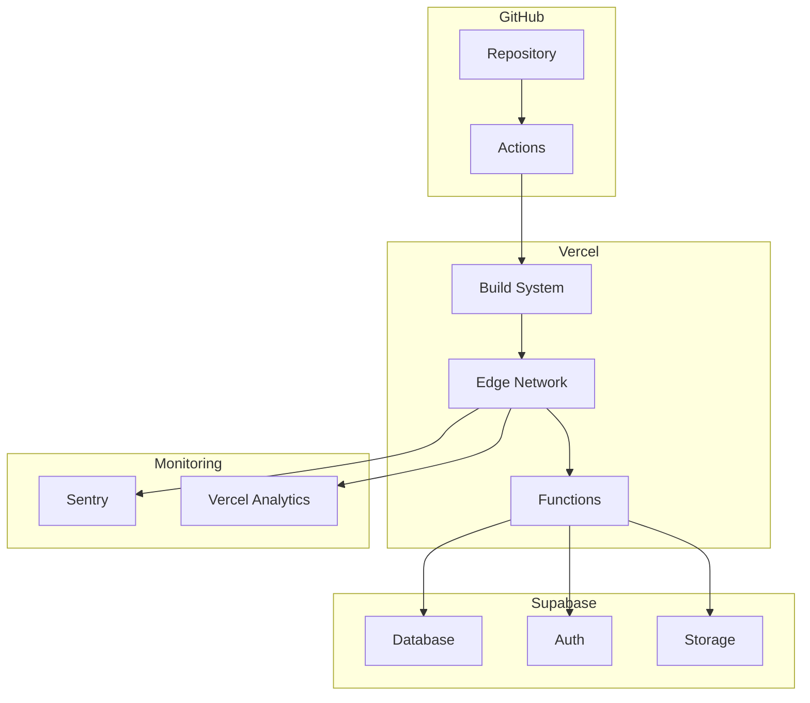
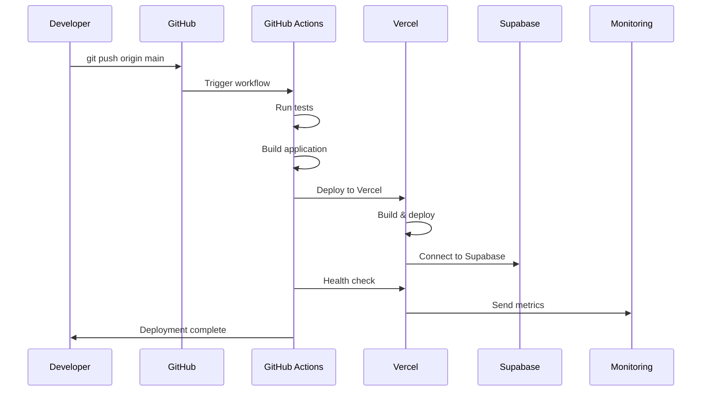

# デプロイメント手順書

## 目次

1. [概要](#概要)
2. [環境構成](#環境構成)
3. [事前準備](#事前準備)
4. [自動デプロイメント](#自動デプロイメント)
5. [手動デプロイメント](#手動デプロイメント)
6. [デプロイメント後の確認](#デプロイメント後の確認)
7. [ロールバック手順](#ロールバック手順)
8. [トラブルシューティング](#トラブルシューティング)

## 概要

このドキュメントでは、ポモドーロタイマーアプリケーションのデプロイメント手順を説明します。

### デプロイメント戦略

- **GitHub Flow**: mainブランチへのマージで自動デプロイ
- **段階的デプロイ**: Preview → Staging → Production
- **ゼロダウンタイム**: ローリングデプロイメント
- **自動ロールバック**: ヘルスチェック失敗時の自動復旧

## 環境構成

### 環境一覧

| 環境        | 用途         | URL                      | ブランチ | 自動デプロイ |
| ----------- | ------------ | ------------------------ | -------- | ------------ |
| Development | 開発         | localhost:5173           | -        | -            |
| Preview     | レビュー     | `*.vercel.app`           | PR       | ✅           |
| Staging     | ステージング | staging.pomodoro-app.com | develop  | ✅           |
| Production  | 本番         | pomodoro-app.com         | main     | ✅           |

### インフラ構成



## 事前準備

### 必要なアカウント・権限

#### 1. GitHub

- リポジトリへの書き込み権限
- GitHub Actions の実行権限
- Secrets の設定権限

#### 2. Vercel

- Vercel アカウント
- プロジェクトの管理権限
- 環境変数の設定権限

#### 3. Supabase

- プロジェクトの管理権限
- データベースアクセス権限
- API キーの管理権限

### 環境変数の設定

#### GitHub Secrets

```bash
# Vercel 関連
VERCEL_TOKEN=your_vercel_token
VERCEL_ORG_ID=your_org_id
VERCEL_PROJECT_ID=your_project_id

# Supabase 関連
SUPABASE_ACCESS_TOKEN=your_supabase_token
SUPABASE_DB_PASSWORD=your_db_password

# 監視関連
SENTRY_AUTH_TOKEN=your_sentry_token
```

#### Vercel 環境変数

```bash
# 本番環境
VITE_SUPABASE_URL=https://your-project.supabase.co
VITE_SUPABASE_ANON_KEY=your_anon_key
VITE_APP_ENV=production
VITE_SENTRY_DSN=your_sentry_dsn

# ステージング環境
VITE_SUPABASE_URL=https://your-staging-project.supabase.co
VITE_SUPABASE_ANON_KEY=your_staging_anon_key
VITE_APP_ENV=staging
VITE_SENTRY_DSN=your_sentry_dsn
```

## 自動デプロイメント

### GitHub Actions ワークフロー

#### メインワークフロー (`.github/workflows/deploy.yml`)

```yaml
name: Deploy to Production

on:
  push:
    branches: [main]

jobs:
  test:
    name: Test & Build
    runs-on: ubuntu-latest

    steps:
      - name: Checkout
        uses: actions/checkout@v4

      - name: Setup Node.js
        uses: actions/setup-node@v4
        with:
          node-version: '18'
          cache: 'pnpm'

      - name: Install dependencies
        run: pnpm install --frozen-lockfile

      - name: Type check
        run: pnpm type-check

      - name: Lint
        run: pnpm lint

      - name: Unit tests
        run: pnpm test --run

      - name: Build
        run: pnpm build

      - name: E2E tests
        run: pnpm test:e2e

  deploy:
    name: Deploy to Vercel
    needs: test
    runs-on: ubuntu-latest

    steps:
      - name: Checkout
        uses: actions/checkout@v4

      - name: Deploy to Vercel
        uses: amondnet/vercel-action@v25
        with:
          vercel-token: ${{ secrets.VERCEL_TOKEN }}
          vercel-org-id: ${{ secrets.VERCEL_ORG_ID }}
          vercel-project-id: ${{ secrets.VERCEL_PROJECT_ID }}
          vercel-args: '--prod'

  health-check:
    name: Health Check
    needs: deploy
    runs-on: ubuntu-latest

    steps:
      - name: Wait for deployment
        run: sleep 30

      - name: Health check
        run: |
          curl -f https://pomodoro-app.com/api/health || exit 1

      - name: Smoke tests
        run: |
          curl -f https://pomodoro-app.com/ || exit 1
          curl -f https://pomodoro-app.com/timer || exit 1
```

#### プレビューデプロイ (`.github/workflows/preview.yml`)

```yaml
name: Deploy Preview

on:
  pull_request:
    branches: [main]

jobs:
  deploy-preview:
    runs-on: ubuntu-latest

    steps:
      - uses: actions/checkout@v4

      - name: Deploy to Vercel
        uses: amondnet/vercel-action@v25
        with:
          vercel-token: ${{ secrets.VERCEL_TOKEN }}
          vercel-org-id: ${{ secrets.VERCEL_ORG_ID }}
          vercel-project-id: ${{ secrets.VERCEL_PROJECT_ID }}
          github-comment: true
```

### デプロイメントフロー



## 手動デプロイメント

### Vercel CLI を使用したデプロイ

#### 1. 初期設定

```bash
# Vercel CLI のインストール
npm install -g vercel

# プロジェクトの初期化
vercel login
vercel link
```

#### 2. プレビューデプロイ

```bash
# 現在のブランチをプレビューデプロイ
vercel

# 特定の環境変数でデプロイ
vercel --env VITE_APP_ENV=staging
```

#### 3. 本番デプロイ

```bash
# 本番環境にデプロイ
vercel --prod

# ビルドログを確認
vercel logs
```

### 緊急デプロイ手順

#### 1. ホットフィックス

```bash
# 緊急修正ブランチを作成
git checkout main
git pull origin main
git checkout -b hotfix/critical-bug-fix

# 修正を実装
# ...

# コミット・プッシュ
git add .
git commit -m "hotfix: fix critical security issue"
git push origin hotfix/critical-bug-fix

# 直接本番にデプロイ（テストをスキップ）
vercel --prod --force
```

#### 2. 緊急ロールバック

```bash
# 前のバージョンにロールバック
vercel rollback

# 特定のデプロイメントにロールバック
vercel rollback <deployment-url>
```

## デプロイメント後の確認

### 自動ヘルスチェック

#### ヘルスチェックエンドポイント

```typescript
// public/api/health.json
{
  "status": "healthy",
  "timestamp": "2024-12-30T12:00:00Z",
  "version": "1.0.0",
  "services": {
    "database": "healthy",
    "auth": "healthy",
    "storage": "healthy"
  }
}
```

#### 監視スクリプト

```bash
#!/bin/bash
# scripts/health-check.sh

URL="https://pomodoro-app.com"
TIMEOUT=30

echo "Starting health check for $URL"

# 基本的な接続確認
if ! curl -f -s --max-time $TIMEOUT "$URL" > /dev/null; then
    echo "ERROR: Main page is not accessible"
    exit 1
fi

# API ヘルスチェック
if ! curl -f -s --max-time $TIMEOUT "$URL/api/health" > /dev/null; then
    echo "ERROR: Health endpoint is not accessible"
    exit 1
fi

# 重要なページの確認
PAGES=("/timer" "/tasks" "/statistics")
for page in "${PAGES[@]}"; do
    if ! curl -f -s --max-time $TIMEOUT "$URL$page" > /dev/null; then
        echo "ERROR: Page $page is not accessible"
        exit 1
    fi
done

echo "All health checks passed"
```

### 手動確認項目

#### 1. 機能確認

- [ ] ページの読み込み速度
- [ ] タイマー機能の動作
- [ ] ユーザー認証
- [ ] データの保存・読み込み
- [ ] リアルタイム同期

#### 2. パフォーマンス確認

```bash
# Lighthouse CI での確認
npx lhci autorun

# Core Web Vitals の確認
curl -s "https://pomodoro-app.com" | grep -o "LCP\|FID\|CLS"
```

#### 3. セキュリティ確認

```bash
# SSL証明書の確認
openssl s_client -connect pomodoro-app.com:443 -servername pomodoro-app.com

# セキュリティヘッダーの確認
curl -I https://pomodoro-app.com
```

## ロールバック手順

### 自動ロールバック

#### GitHub Actions でのロールバック

```yaml
name: Auto Rollback

on:
  workflow_run:
    workflows: ['Deploy to Production']
    types: [completed]

jobs:
  health-check:
    if: ${{ github.event.workflow_run.conclusion == 'success' }}
    runs-on: ubuntu-latest

    steps:
      - name: Wait for deployment
        run: sleep 60

      - name: Health check
        id: health
        run: |
          if ! curl -f https://pomodoro-app.com/api/health; then
            echo "health_failed=true" >> $GITHUB_OUTPUT
          fi

      - name: Rollback on failure
        if: steps.health.outputs.health_failed == 'true'
        run: |
          vercel rollback --token ${{ secrets.VERCEL_TOKEN }}
```

### 手動ロールバック

#### 1. Vercel ダッシュボード

1. Vercel ダッシュボードにアクセス
2. プロジェクトを選択
3. Deployments タブを開く
4. 前の安定したデプロイメントを選択
5. "Promote to Production" をクリック

#### 2. CLI でのロールバック

```bash
# 利用可能なデプロイメント一覧
vercel ls

# 特定のデプロイメントにロールバック
vercel promote <deployment-url>

# 直前のデプロイメントにロールバック
vercel rollback
```

#### 3. Git でのロールバック

```bash
# 問題のあるコミットを特定
git log --oneline -10

# リバートコミットを作成
git revert <commit-hash>

# プッシュして自動デプロイ
git push origin main
```

### データベースロールバック

#### マイグレーションのロールバック

```sql
-- Supabase でのマイグレーション取り消し
-- 注意: データ損失の可能性があるため慎重に実行

-- 1. バックアップの確認
SELECT * FROM _supabase_migrations ORDER BY version DESC LIMIT 5;

-- 2. 特定のマイグレーションを取り消し
-- (手動でDDL文を実行)

-- 3. マイグレーション履歴の更新
DELETE FROM _supabase_migrations WHERE version = 'target_version';
```

## トラブルシューティング

### よくある問題と対処法

#### 1. ビルドエラー

```bash
# 問題: TypeScript エラー
# 対処法:
pnpm type-check
# エラーを修正してから再デプロイ

# 問題: 依存関係エラー
# 対処法:
rm -rf node_modules pnpm-lock.yaml
pnpm install
```

#### 2. 環境変数エラー

```bash
# 問題: 環境変数が設定されていない
# 対処法:
vercel env ls
vercel env add VITE_SUPABASE_URL production
```

#### 3. データベース接続エラー

```bash
# 問題: Supabase 接続エラー
# 対処法:
# 1. Supabase ダッシュボードでサービス状態確認
# 2. API キーの有効性確認
# 3. ネットワーク設定確認
```

#### 4. パフォーマンス問題

```bash
# 問題: 読み込み速度が遅い
# 対処法:
# 1. バンドルサイズの確認
pnpm analyze

# 2. 画像最適化の確認
# 3. CDN キャッシュの確認
```

### エラーログの確認

#### Vercel ログ

```bash
# リアルタイムログの確認
vercel logs --follow

# 特定の期間のログ
vercel logs --since 1h

# エラーログのみ
vercel logs --level error
```

#### GitHub Actions ログ

```bash
# GitHub CLI でログ確認
gh run list
gh run view <run-id>
gh run view <run-id> --log
```

### 緊急時の連絡先

#### エスカレーション手順

1. **Level 1**: 開発チーム内で対応
2. **Level 2**: テックリード・アーキテクトに連絡
3. **Level 3**: プロダクトマネージャーに連絡
4. **Level 4**: 外部サポート（Vercel, Supabase）

#### 連絡先リスト

```yaml
contacts:
  tech_lead:
    name: 'Tech Lead'
    email: 'tech-lead@company.com'
    phone: '+81-90-xxxx-xxxx'

  devops:
    name: 'DevOps Engineer'
    email: 'devops@company.com'
    phone: '+81-90-xxxx-xxxx'

  product_manager:
    name: 'Product Manager'
    email: 'pm@company.com'
    phone: '+81-90-xxxx-xxxx'

external_support:
  vercel:
    support_url: 'https://vercel.com/support'
    priority_support: 'enterprise@vercel.com'

  supabase:
    support_url: 'https://supabase.com/support'
    discord: 'https://discord.supabase.com'
```

## デプロイメントチェックリスト

### リリース前チェックリスト

#### コード品質

- [ ] すべてのテストが通過
- [ ] コードレビューが完了
- [ ] セキュリティスキャンが完了
- [ ] パフォーマンステストが完了

#### 環境設定

- [ ] 環境変数が正しく設定されている
- [ ] データベースマイグレーションが完了
- [ ] 外部サービスの接続確認

#### ドキュメント

- [ ] CHANGELOG.md が更新されている
- [ ] API ドキュメントが最新
- [ ] 運用手順書が更新されている

### リリース後チェックリスト

#### 即座に確認（5分以内）

- [ ] アプリケーションが正常に起動
- [ ] 主要機能が動作
- [ ] エラー率が正常範囲内

#### 短期確認（30分以内）

- [ ] パフォーマンス指標が正常
- [ ] ユーザーからの問い合わせなし
- [ ] 監視アラートなし

#### 中期確認（24時間以内）

- [ ] 全機能の動作確認
- [ ] データ整合性の確認
- [ ] ユーザーフィードバックの確認

---

## 参考資料

### 公式ドキュメント

- [Vercel Documentation](https://vercel.com/docs)
- [GitHub Actions Documentation](https://docs.github.com/en/actions)
- [Supabase Documentation](https://supabase.com/docs)

### 内部ドキュメント

- [アーキテクチャドキュメント](./architecture.md)
- [監視・アラート設定ガイド](./monitoring-guide.md)
- [インシデント対応手順](./incident-response.md)

---

_このデプロイメント手順書は、システムの変更に応じて定期的に更新してください。_
