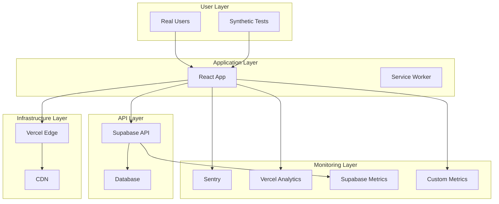
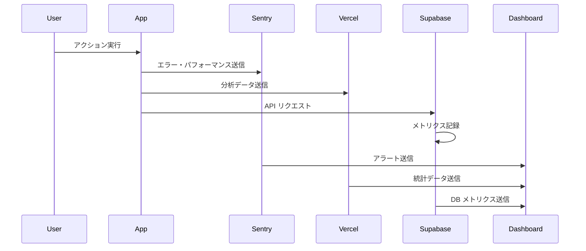
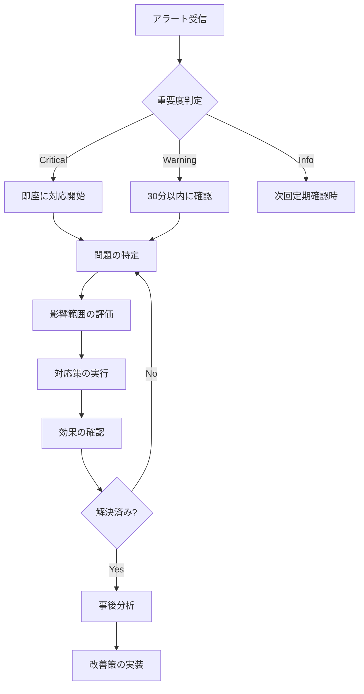

# 監視・アラート設定ガイド

## 目次

1. [概要](#概要)
2. [監視アーキテクチャ](#監視アーキテクチャ)
3. [メトリクス定義](#メトリクス定義)
4. [アラート設定](#アラート設定)
5. [ダッシュボード設定](#ダッシュボード設定)
6. [ログ管理](#ログ管理)
7. [パフォーマンス監視](#パフォーマンス監視)
8. [セキュリティ監視](#セキュリティ監視)
9. [運用手順](#運用手順)

## 概要

このガイドでは、ポモドーロタイマーアプリケーションの監視・アラート設定について説明します。

### 監視の目的

- **可用性**: サービスの稼働状況監視
- **パフォーマンス**: 応答時間・スループット監視
- **エラー**: エラー率・例外監視
- **ユーザー体験**: Core Web Vitals・UX指標監視
- **セキュリティ**: 不正アクセス・脆弱性監視

### 監視ツール

| ツール             | 用途                     | 責任範囲             |
| ------------------ | ------------------------ | -------------------- |
| Vercel Analytics   | パフォーマンス・使用統計 | フロントエンド       |
| Sentry             | エラー・例外監視         | アプリケーション全体 |
| Supabase Dashboard | データベース・API監視    | バックエンド         |
| Lighthouse CI      | Core Web Vitals          | パフォーマンス       |
| GitHub Actions     | CI/CD・デプロイ監視      | インフラ             |

## 監視アーキテクチャ

### 監視レイヤー



### データフロー



## メトリクス定義

### 1. 可用性メトリクス

#### アップタイム

```typescript
// 可用性の計算
const calculateUptime = (totalTime: number, downTime: number): number => {
  return ((totalTime - downTime) / totalTime) * 100;
};

// 目標値
const SLA_TARGETS = {
  uptime: 99.9, // 99.9% 以上
  maxDowntime: 43.2, // 月間最大 43.2 分
};
```

#### ヘルスチェック

```typescript
// アプリケーションヘルスチェック
interface HealthStatus {
  status: 'healthy' | 'degraded' | 'unhealthy';
  timestamp: string;
  services: {
    frontend: ServiceHealth;
    api: ServiceHealth;
    database: ServiceHealth;
    auth: ServiceHealth;
  };
}

interface ServiceHealth {
  status: 'healthy' | 'degraded' | 'unhealthy';
  responseTime?: number;
  lastCheck: string;
  error?: string;
}
```

### 2. パフォーマンスメトリクス

#### Core Web Vitals

```typescript
// Core Web Vitals の閾値
const CORE_WEB_VITALS_THRESHOLDS = {
  LCP: {
    good: 2500, // 2.5秒以下
    needsImprovement: 4000, // 4秒以下
  },
  FID: {
    good: 100, // 100ms以下
    needsImprovement: 300, // 300ms以下
  },
  CLS: {
    good: 0.1, // 0.1以下
    needsImprovement: 0.25, // 0.25以下
  },
};
```

#### API パフォーマンス

```typescript
// API レスポンス時間の監視
const API_PERFORMANCE_THRESHOLDS = {
  responseTime: {
    p50: 200, // 50パーセンタイル: 200ms以下
    p95: 500, // 95パーセンタイル: 500ms以下
    p99: 1000, // 99パーセンタイル: 1秒以下
  },
  throughput: {
    min: 100, // 最小 100 req/min
    target: 1000, // 目標 1000 req/min
  },
};
```

### 3. エラーメトリクス

#### エラー率

```typescript
// エラー率の計算
const calculateErrorRate = (errors: number, total: number): number => {
  return (errors / total) * 100;
};

// エラー率の閾値
const ERROR_RATE_THRESHOLDS = {
  warning: 1, // 1% で警告
  critical: 5, // 5% で重大
  emergency: 10, // 10% で緊急
};
```

#### エラー分類

```typescript
interface ErrorMetrics {
  // HTTP エラー
  http4xx: number; // クライアントエラー
  http5xx: number; // サーバーエラー

  // JavaScript エラー
  jsErrors: number;
  unhandledRejections: number;

  // ネットワークエラー
  networkErrors: number;
  timeoutErrors: number;

  // 認証エラー
  authErrors: number;
  permissionErrors: number;
}
```

### 4. ビジネスメトリクス

#### ユーザーエンゲージメント

```typescript
interface UserMetrics {
  // アクティブユーザー
  dailyActiveUsers: number;
  weeklyActiveUsers: number;
  monthlyActiveUsers: number;

  // セッション指標
  averageSessionDuration: number;
  sessionsPerUser: number;
  bounceRate: number;

  // 機能使用率
  timerUsageRate: number;
  taskCreationRate: number;
  statisticsViewRate: number;
}
```

## アラート設定

### 1. Sentry アラート設定

#### プロジェクト設定

```javascript
// sentry.client.config.ts
import * as Sentry from '@sentry/react';

Sentry.init({
  dsn: process.env.VITE_SENTRY_DSN,
  environment: process.env.VITE_APP_ENV,

  // パフォーマンス監視
  tracesSampleRate: 1.0,

  // セッション監視
  autoSessionTracking: true,

  // エラーフィルタリング
  beforeSend(event) {
    // 開発環境では送信しない
    if (process.env.VITE_APP_ENV === 'development') {
      return null;
    }
    return event;
  },

  // パフォーマンス監視
  beforeTransaction(context) {
    return context;
  },
});
```

#### アラートルール

```yaml
# Sentry Alert Rules
alerts:
  - name: 'High Error Rate'
    conditions:
      - 'event.count > 10 in 5m'
    actions:
      - 'email:dev-team@company.com'
      - 'slack:#alerts'

  - name: 'Performance Degradation'
    conditions:
      - 'transaction.duration.p95 > 2000ms in 10m'
    actions:
      - 'email:dev-team@company.com'

  - name: 'New Release Issues'
    conditions:
      - 'event.count > 5 in 1m'
      - 'release:latest'
    actions:
      - 'email:dev-team@company.com'
      - 'slack:#releases'
```

### 2. Vercel 監視設定

#### 関数監視

```typescript
// vercel.json
{
  "functions": {
    "app/api/**/*.ts": {
      "maxDuration": 30
    }
  },
  "monitoring": {
    "alerts": [
      {
        "name": "High Error Rate",
        "condition": "error_rate > 0.05",
        "action": "email"
      },
      {
        "name": "Slow Response Time",
        "condition": "p99_duration > 5000",
        "action": "email"
      }
    ]
  }
}
```

### 3. カスタムアラート

#### ヘルスチェック監視

```typescript
// scripts/health-monitor.ts
class HealthMonitor {
  private readonly endpoints = [
    'https://pomodoro-app.com',
    'https://pomodoro-app.com/api/health',
  ];

  async checkHealth(): Promise<void> {
    for (const endpoint of this.endpoints) {
      try {
        const response = await fetch(endpoint, {
          timeout: 10000,
        });

        if (!response.ok) {
          await this.sendAlert({
            level: 'critical',
            message: `Endpoint ${endpoint} returned ${response.status}`,
            endpoint,
          });
        }
      } catch (error) {
        await this.sendAlert({
          level: 'critical',
          message: `Endpoint ${endpoint} is unreachable: ${error.message}`,
          endpoint,
        });
      }
    }
  }

  private async sendAlert(alert: Alert): Promise<void> {
    // Slack, Email, PagerDuty などに送信
    await Promise.all([this.sendToSlack(alert), this.sendToEmail(alert)]);
  }
}
```

### 4. GitHub Actions 監視

```yaml
# .github/workflows/monitoring.yml
name: Health Check

on:
  schedule:
    - cron: '*/5 * * * *' # 5分毎
  workflow_dispatch:

jobs:
  health-check:
    runs-on: ubuntu-latest

    steps:
      - name: Check Main Site
        run: |
          if ! curl -f -s --max-time 10 https://pomodoro-app.com > /dev/null; then
            echo "::error::Main site is down"
            exit 1
          fi

      - name: Check API Health
        run: |
          response=$(curl -s https://pomodoro-app.com/api/health)
          status=$(echo $response | jq -r '.status')
          if [ "$status" != "healthy" ]; then
            echo "::error::API health check failed: $response"
            exit 1
          fi

      - name: Notify on Failure
        if: failure()
        uses: 8398a7/action-slack@v3
        with:
          status: failure
          webhook_url: ${{ secrets.SLACK_WEBHOOK }}
```

## ダッシュボード設定

### 1. Vercel Analytics ダッシュボード

#### 主要指標

```typescript
// カスタムイベントの送信
import { track } from '@vercel/analytics';

// ユーザーアクション追跡
const trackUserAction = (action: string, properties?: Record<string, any>) => {
  track(action, {
    timestamp: Date.now(),
    ...properties,
  });
};

// 使用例
trackUserAction('timer_started', { duration: 1500 });
trackUserAction('task_created', { hasDescription: true });
trackUserAction('session_completed', { type: 'pomodoro' });
```

### 2. Sentry パフォーマンス監視

#### カスタムトランザクション

```typescript
import * as Sentry from '@sentry/react';

// パフォーマンス測定
const measurePerformance = async (
  name: string,
  operation: () => Promise<any>
) => {
  const transaction = Sentry.startTransaction({
    name,
    op: 'custom',
  });

  try {
    const result = await operation();
    transaction.setStatus('ok');
    return result;
  } catch (error) {
    transaction.setStatus('internal_error');
    throw error;
  } finally {
    transaction.finish();
  }
};

// 使用例
await measurePerformance('load_tasks', async () => {
  return await taskService.loadTasks();
});
```

### 3. カスタムダッシュボード

#### メトリクス収集

```typescript
// src/services/metrics-service.ts
class MetricsService {
  private metrics: Metric[] = [];

  recordMetric(
    name: string,
    value: number,
    tags?: Record<string, string>
  ): void {
    this.metrics.push({
      name,
      value,
      timestamp: Date.now(),
      tags: {
        environment: process.env.VITE_APP_ENV,
        version: process.env.VITE_APP_VERSION,
        ...tags,
      },
    });

    // バッチで送信
    if (this.metrics.length >= 10) {
      this.flush();
    }
  }

  private async flush(): Promise<void> {
    if (this.metrics.length === 0) return;

    try {
      await fetch('/api/metrics', {
        method: 'POST',
        headers: { 'Content-Type': 'application/json' },
        body: JSON.stringify(this.metrics),
      });

      this.metrics = [];
    } catch (error) {
      console.error('Failed to send metrics:', error);
    }
  }
}
```

## ログ管理

### 1. 構造化ログ

#### ログフォーマット

```typescript
// src/utils/logger.ts
interface LogEntry {
  timestamp: string;
  level: 'debug' | 'info' | 'warn' | 'error';
  message: string;
  context?: Record<string, any>;
  userId?: string;
  sessionId?: string;
  traceId?: string;
}

class Logger {
  private context: Record<string, any> = {};

  setContext(context: Record<string, any>): void {
    this.context = { ...this.context, ...context };
  }

  info(message: string, extra?: Record<string, any>): void {
    this.log('info', message, extra);
  }

  error(message: string, error?: Error, extra?: Record<string, any>): void {
    this.log('error', message, {
      error: error?.message,
      stack: error?.stack,
      ...extra,
    });
  }

  private log(
    level: LogEntry['level'],
    message: string,
    extra?: Record<string, any>
  ): void {
    const entry: LogEntry = {
      timestamp: new Date().toISOString(),
      level,
      message,
      context: { ...this.context, ...extra },
      userId: this.getCurrentUserId(),
      sessionId: this.getSessionId(),
      traceId: this.getTraceId(),
    };

    // 開発環境ではコンソール出力
    if (process.env.VITE_APP_ENV === 'development') {
      console.log(JSON.stringify(entry, null, 2));
    }

    // 本番環境では外部サービスに送信
    if (process.env.VITE_APP_ENV === 'production') {
      this.sendToLogService(entry);
    }
  }
}
```

### 2. エラーログ

#### エラー分類

```typescript
// エラーの分類と処理
class ErrorHandler {
  handleError(error: Error, context?: Record<string, any>): void {
    const errorType = this.classifyError(error);

    switch (errorType) {
      case 'NetworkError':
        this.handleNetworkError(error, context);
        break;
      case 'AuthenticationError':
        this.handleAuthError(error, context);
        break;
      case 'ValidationError':
        this.handleValidationError(error, context);
        break;
      default:
        this.handleGenericError(error, context);
    }
  }

  private classifyError(error: Error): string {
    if (error.message.includes('fetch')) return 'NetworkError';
    if (error.message.includes('auth')) return 'AuthenticationError';
    if (error.message.includes('validation')) return 'ValidationError';
    return 'GenericError';
  }
}
```

## パフォーマンス監視

### 1. Core Web Vitals 監視

#### 自動測定

```typescript
// src/utils/web-vitals.ts
import { getCLS, getFID, getFCP, getLCP, getTTFB } from 'web-vitals';

const sendToAnalytics = (metric: any) => {
  // Vercel Analytics に送信
  if (window.va) {
    window.va('event', 'Web Vital', {
      name: metric.name,
      value: metric.value,
      rating: metric.rating,
    });
  }

  // Sentry に送信
  Sentry.addBreadcrumb({
    category: 'web-vital',
    message: `${metric.name}: ${metric.value}`,
    level: 'info',
  });
};

// Web Vitals の測定開始
export const startWebVitalsMonitoring = () => {
  getCLS(sendToAnalytics);
  getFID(sendToAnalytics);
  getFCP(sendToAnalytics);
  getLCP(sendToAnalytics);
  getTTFB(sendToAnalytics);
};
```

### 2. カスタムパフォーマンス指標

#### ユーザー体験指標

```typescript
// ユーザー体験の測定
class UXMetrics {
  measureTimeToInteractive(): void {
    const observer = new PerformanceObserver(list => {
      const entries = list.getEntries();
      entries.forEach(entry => {
        if (entry.name === 'first-input') {
          this.recordMetric('time_to_interactive', entry.startTime);
        }
      });
    });

    observer.observe({ entryTypes: ['first-input'] });
  }

  measureTaskCompletion(): void {
    const startTime = performance.now();

    // タスク完了時に測定
    document.addEventListener('task-completed', () => {
      const duration = performance.now() - startTime;
      this.recordMetric('task_completion_time', duration);
    });
  }
}
```

## セキュリティ監視

### 1. 不正アクセス検知

#### 異常なアクセスパターン

```typescript
// セキュリティイベントの監視
class SecurityMonitor {
  private loginAttempts = new Map<string, number>();

  monitorLoginAttempts(email: string, success: boolean): void {
    if (!success) {
      const attempts = this.loginAttempts.get(email) || 0;
      this.loginAttempts.set(email, attempts + 1);

      if (attempts >= 5) {
        this.sendSecurityAlert({
          type: 'brute_force_attempt',
          email,
          attempts: attempts + 1,
          timestamp: new Date().toISOString(),
        });
      }
    } else {
      this.loginAttempts.delete(email);
    }
  }

  monitorAPIUsage(userId: string, endpoint: string): void {
    const key = `${userId}:${endpoint}`;
    const requests = this.getRequestCount(key);

    if (requests > 100) {
      // 1分間に100リクエスト以上
      this.sendSecurityAlert({
        type: 'rate_limit_exceeded',
        userId,
        endpoint,
        requests,
        timestamp: new Date().toISOString(),
      });
    }
  }
}
```

### 2. データ保護監視

#### 機密データアクセス

```typescript
// データアクセスの監査
class DataAuditLogger {
  logDataAccess(
    operation: string,
    table: string,
    userId: string,
    recordId?: string
  ): void {
    const auditEntry = {
      timestamp: new Date().toISOString(),
      operation,
      table,
      userId,
      recordId,
      ipAddress: this.getClientIP(),
      userAgent: navigator.userAgent,
    };

    // 監査ログに記録
    this.sendAuditLog(auditEntry);

    // 機密操作の場合は即座にアラート
    if (this.isSensitiveOperation(operation, table)) {
      this.sendSecurityAlert({
        type: 'sensitive_data_access',
        ...auditEntry,
      });
    }
  }
}
```

## 運用手順

### 1. 日次監視タスク

#### 監視チェックリスト

```markdown
## 日次監視チェックリスト

### システム稼働状況

- [ ] アプリケーションの稼働確認
- [ ] API エンドポイントの応答確認
- [ ] データベース接続確認

### パフォーマンス

- [ ] Core Web Vitals の確認
- [ ] API レスポンス時間の確認
- [ ] エラー率の確認

### セキュリティ

- [ ] 不正アクセス試行の確認
- [ ] セキュリティアラートの確認
- [ ] SSL 証明書の有効期限確認

### ユーザー体験

- [ ] ユーザーフィードバックの確認
- [ ] 主要機能の動作確認
- [ ] モバイル対応の確認
```

### 2. 週次レビュー

#### パフォーマンスレポート

```typescript
// 週次パフォーマンスレポート生成
class WeeklyReport {
  async generateReport(
    startDate: Date,
    endDate: Date
  ): Promise<PerformanceReport> {
    const metrics = await this.collectMetrics(startDate, endDate);

    return {
      period: { startDate, endDate },
      summary: {
        uptime: this.calculateUptime(metrics),
        averageResponseTime: this.calculateAverageResponseTime(metrics),
        errorRate: this.calculateErrorRate(metrics),
        userSatisfaction: this.calculateUserSatisfaction(metrics),
      },
      trends: {
        performanceTrend: this.analyzePerformanceTrend(metrics),
        errorTrend: this.analyzeErrorTrend(metrics),
        usageTrend: this.analyzeUsageTrend(metrics),
      },
      recommendations: this.generateRecommendations(metrics),
    };
  }
}
```

### 3. インシデント対応

#### アラート対応フロー



### 4. 定期メンテナンス

#### 月次メンテナンス

```bash
#!/bin/bash
# scripts/monthly-maintenance.sh

echo "Starting monthly maintenance..."

# 1. ログのローテーション
echo "Rotating logs..."
find /var/log -name "*.log" -mtime +30 -delete

# 2. メトリクスデータのクリーンアップ
echo "Cleaning up old metrics..."
# 90日以上古いメトリクスを削除

# 3. SSL証明書の確認
echo "Checking SSL certificates..."
openssl s_client -connect pomodoro-app.com:443 -servername pomodoro-app.com 2>/dev/null | openssl x509 -noout -dates

# 4. 依存関係の更新確認
echo "Checking for dependency updates..."
pnpm outdated

# 5. セキュリティスキャン
echo "Running security scan..."
pnpm audit

echo "Monthly maintenance completed."
```

---

## 緊急連絡先

### エスカレーション手順

```yaml
escalation:
  level_1:
    title: '開発チーム'
    response_time: '15分'
    contacts:
      - 'dev-team@company.com'
      - 'slack:#dev-alerts'

  level_2:
    title: 'テックリード'
    response_time: '30分'
    contacts:
      - 'tech-lead@company.com'
      - '+81-90-xxxx-xxxx'

  level_3:
    title: 'プロダクトマネージャー'
    response_time: '1時間'
    contacts:
      - 'pm@company.com'
      - '+81-90-xxxx-xxxx'
```

---

_この監視・アラート設定ガイドは、システムの成長と共に継続的に更新してください。_
